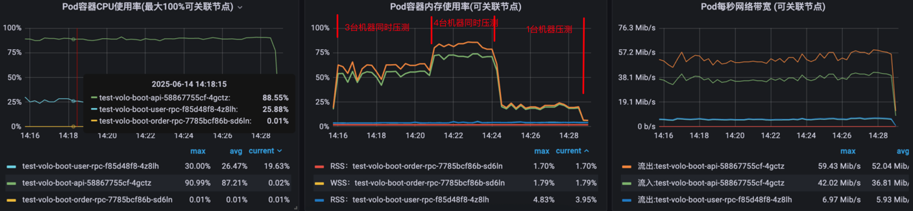
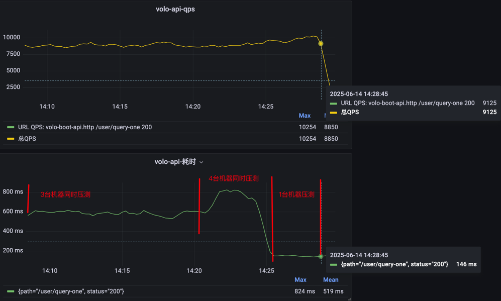

# volo-http 和 volo-rpc整合示例
## 目录结构
* /api: 网关模块
* ~~/common: 放一些公共组件代码, 如日志配置等~~ 已替换为: [pd-rs-common](https://docs.rs/pd-rs-common/0.1.2/pd_rs_common/)
* /rpc: 放rpc服务

## 相关issue
[issue](https://github.com/cloudwego/volo/issues/550)

## 功能进度
- [x] 基于volo的http网关代码  
- [x] 基于volo的grpc服务代码
- [x] 使用nacos作为服务注册发现中心
- [x] 从http网关到调用grpc服务的调用代码
- [x] http网关模块集成prometheus
- [x] 限流组件(基于nacos配置的简易内存版限流，正则匹配path, 支持配置动态更新)
- [x] 拦截请求header或参数
- [x] 性能强悍(能抗住超高QPS)

## 构建镜像
> 注意！国内用户如果有代理的话，先加上代理，再编译  
> ```shell
> export http_proxy=http://127.0.0.1:7890  
> export https_proxy=http://127.0.0.1:7890  
> ```
### api
在项目根目录下执行下面命令:
```shell
docker buildx build \
  --allow network.host \
  --platform linux/amd64 \
  --progress=auto \
  --load \
  -f api/Dockerfile \
  -t intfish123/volo-boot-api:v0.1.0 .
```
### order-rpc
在项目根目录下执行下面命令:
```shell
cd rpc/order
docker buildx build \
  --allow network.host \
  --platform linux/amd64 \
  --progress=auto \
  --load \
  -f Dockerfile \
  -t intfish123/volo-boot-order-rpc:v0.1.0  .
```
### user-rpc
在项目根目录下执行下面命令:
```shell
cd rpc/user
docker buildx build \
  --allow network.host \
  --platform linux/amd64 \
  --progress=auto \
  --load \
  -f Dockerfile \
  -t intfish123/volo-boot-user-rpc:v0.1.0  .
```

### 压测
使用 apache bench 工具, 压测命令:  `ab -n 3000000 -c 2000  http://10.30.160.139:8080/user/query-one?id=123`    
Pod资源设置: api服务和rpc都限制为: 2核 512MB  
   
**资源使用:** 


**QPS和耗时:**  


**第一台机器输出:**  
```shell
Server Software:        
Server Hostname:        10.30.160.139
Server Port:            8080

Document Path:          /user/query-one?id=123
Document Length:        126 bytes

Concurrency Level:      2000
Time taken for tests:   1051.129 seconds
Complete requests:      3000000
Failed requests:        0
Write errors:           0
Total transferred:      996000000 bytes
HTML transferred:       378000000 bytes
Requests per second:    2854.07 [#/sec] (mean)
Time per request:       700.753 [ms] (mean)
Time per request:       0.350 [ms] (mean, across all concurrent requests)
Transfer rate:          925.34 [Kbytes/sec] received

Connection Times (ms)
              min  mean[+/-sd] median   max
Connect:        1    6  67.1      2    3010
Processing:    14  694 157.6    698    1538
Waiting:        6  694 157.6    698    1538
Total:         31  700 172.1    700    4149

Percentage of the requests served within a certain time (ms)
  50%    700
  66%    752
  75%    785
  80%    808
  90%    886
  95%    979
  98%   1078
  99%   1135
 100%   4149 (longest request)
```
**第二台机器输出:**  
```shell
Server Software:        
Server Hostname:        10.30.160.139
Server Port:            8080

Document Path:          /user/query-one?id=123
Document Length:        126 bytes

Concurrency Level:      2000
Time taken for tests:   1064.812 seconds
Complete requests:      3000000
Failed requests:        0
Total transferred:      996000000 bytes
HTML transferred:       378000000 bytes
Requests per second:    2817.40 [#/sec] (mean)
Time per request:       709.875 [ms] (mean)
Time per request:       0.355 [ms] (mean, across all concurrent requests)
Transfer rate:          913.45 [Kbytes/sec] received

Connection Times (ms)
              min  mean[+/-sd] median   max
Connect:        3    8  67.5      4    1071
Processing:    22  701 151.4    702    1559
Waiting:       22  701 151.4    702    1559
Total:         25  709 166.8    706    2310

Percentage of the requests served within a certain time (ms)
  50%    706
  66%    758
  75%    791
  80%    813
  90%    891
  95%    985
  98%   1084
  99%   1143
 100%   2310 (longest request)
```
**第三台机器输出:**  
```shell
Server Software:        
Server Hostname:        10.30.160.139
Server Port:            8080

Document Path:          /user/query-one?id=123
Document Length:        126 bytes

Concurrency Level:      2000
Time taken for tests:   1064.534 seconds
Complete requests:      3000000
Failed requests:        0
Total transferred:      996000000 bytes
HTML transferred:       378000000 bytes
Requests per second:    2818.14 [#/sec] (mean)
Time per request:       709.689 [ms] (mean)
Time per request:       0.355 [ms] (mean, across all concurrent requests)
Transfer rate:          913.69 [Kbytes/sec] received

Connection Times (ms)
              min  mean[+/-sd] median   max
Connect:        3    8  67.0      4    1071
Processing:    26  701 151.9    702    1590
Waiting:       26  701 151.9    702    1590
Total:         30  709 167.1    706    2326

Percentage of the requests served within a certain time (ms)
  50%    706
  66%    758
  75%    791
  80%    814
  90%    891
  95%    985
  98%   1084
  99%   1142
 100%   2326 (longest request)
```
**第4台机器输出:**  
```shell
Server Software:        
Server Hostname:        10.30.160.139
Server Port:            8080

Document Path:          /user/query-one?id=123
Document Length:        126 bytes

Concurrency Level:      2000
Time taken for tests:   471.436 seconds
Complete requests:      3000000
Failed requests:        0
Total transferred:      996000000 bytes
HTML transferred:       378000000 bytes
Requests per second:    6363.54 [#/sec] (mean)
Time per request:       314.291 [ms] (mean)
Time per request:       0.157 [ms] (mean, across all concurrent requests)
Transfer rate:          2063.18 [Kbytes/sec] received

Connection Times (ms)
              min  mean[+/-sd] median   max
Connect:        3    6  39.6      4    1070
Processing:    19  308 257.4    214    1568
Waiting:       19  308 257.4    214    1568
Total:         22  314 263.6    218    2275

Percentage of the requests served within a certain time (ms)
  50%    218
  66%    249
  75%    276
  80%    303
  90%    823
  95%    968
  98%   1069
  99%   1117
 100%   2275 (longest request)
```
## 说明
目前这个示例项目架构还没在生产环境验证，只是自己学习和测试用

交流学习群:  
